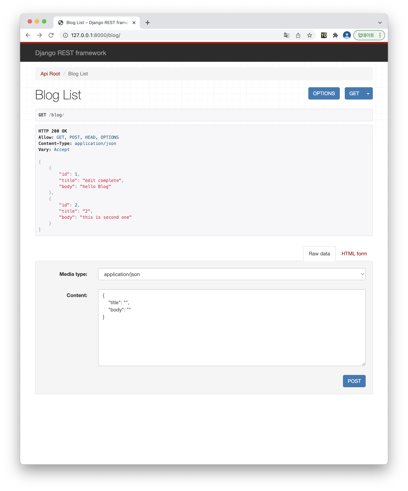
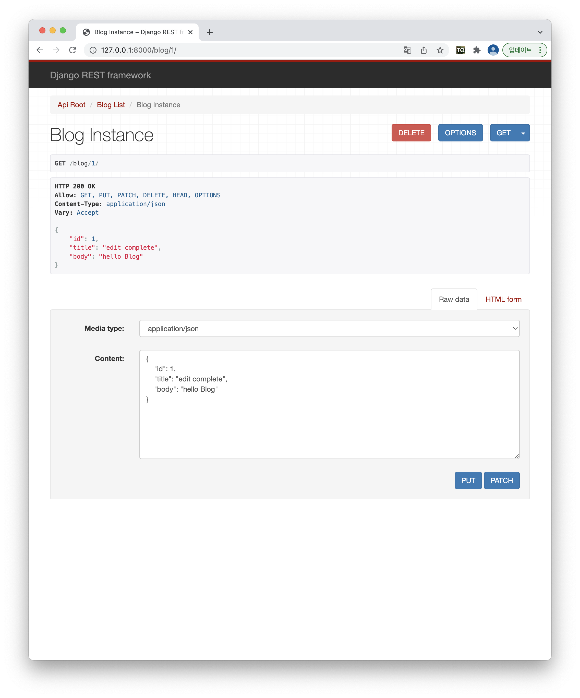

# Django-ViewSet
ViewSet 을 이용해서 CRUD 를 구현하면서 CBV 와 함께 공부

- Blog_list
  - get ( 게시물 목록을 get 한다.)
  - post ( 게시물 Post 한다. )

- Blog_detail 
  - patch ( pk 값의 게시물의 수정내용을 업데이트 한다. )
  - put ( pk 값의 게시물의 전체 내용을 없데이트 한다. )
  - delete ( pk 값의 게시물의 내용을 삭제한다. )

- 참고자료 : https://www.django-rest-framework.org/tutorial/6-viewsets-and-routers/
