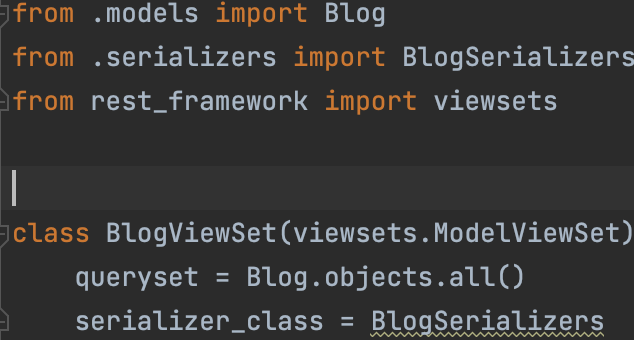

# Django-ViewSet
ViewSet 을 이용해서 CRUD 를 구현하면서 CBV 와 함께 공부

- ModelViewSet 클래스를 살펴보면, Mixins 클래스를 상속받고 있습니다.

- CreateModelMixin, RetrieveModelMixin 등 CRUD의 기능을 하는 다양한 클래스를 상속받은 것을 확인할수있습니다.

- GenericViewSet의 내부를 살펴보면 아래와 같이 generics의 GenericAPIView를 상속 받고 있습니다. 

- 그래서 ViewSets 으로 구현할때 상속을 여러번 거친만큼 코드가 간결해졌습니다.

  
  - Blog_list
    - get ( 게시물 목록을 get 한다.)
    - post ( 게시물 Post 한다. )

  
  - Blog_detail 
    - patch ( pk 값의 게시물의 수정내용을 업데이트 한다. )
    - put ( pk 값의 게시물의 전체 내용을 없데이트 한다. )
    - delete ( pk 값의 게시물의 내용을 삭제한다. )

  - 참고자료 
    - https://www.django-rest-framework.org/tutorial/6-viewsets-and-routers/
    - https://github.com/encode/django-rest-framework/blob/19655edbf782aa1fbdd7f8cd56ff9e0b7786ad3c/rest_framework/viewsets.py
